# 📊 Marketing Performance Intelligence Dashboard

> **An End-to-End Marketing Analytics Case Study using Python, SQLite, SQL, Matplotlib, and Power BI**


---

# Executive Summary

Marketing teams invest significant budgets across multiple advertising platforms, yet identifying **which campaigns truly generate profitable business outcomes** remains a persistent challenge.

This project presents a complete analytics solution that transforms raw marketing campaign data into strategic business intelligence. Using Python for data preparation, SQLite for structured storage, SQL for business analysis, Matplotlib for exploratory analytics, and Power BI for executive reporting, the project demonstrates how data analysts can convert operational marketing data into actionable recommendations.

Rather than reporting vanity metrics such as impressions or clicks alone, this dashboard focuses on business-centric KPIs including:

* Return on Investment (ROI)
* Cost per Enrollment (CPE)
* Funnel Leakage Rate
* Enrollment Yield Ratio
* Revenue Performance
* Campaign Profitability
* Regional Performance
* Platform Effectiveness

The final deliverable enables marketing stakeholders to understand where advertising spend creates value, where conversion losses occur, and how future investments can be optimized.

---

# Executive Dashboard Preview

> Replace this image with your preferred dashboard cover screenshot.

```markdown
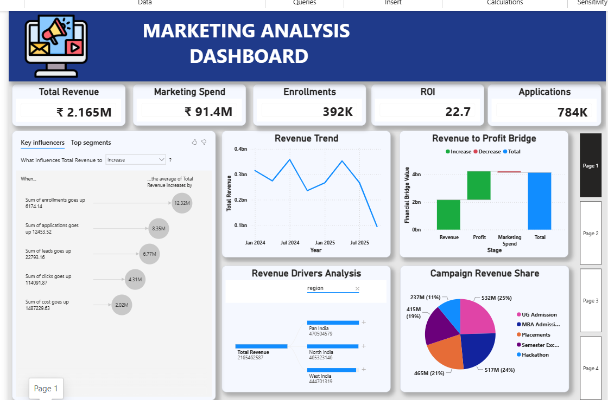
```


---

# Table of Contents

* Executive Dashboard Preview
* Project Overview
* Business Problem
* Business Objectives
* Technology Stack
* Project Workflow
* Repository Structure
* Dataset Description
* Data Cleaning & Preparation
* Exploratory Data Analysis
* SQL Business Analysis
* Power BI Dashboard
* Executive Insights
* Strategic Recommendations
* Installation
* Future Enhancements
* Author

---

# Project Overview

## Overview

The **Marketing Performance Intelligence Dashboard** is an end-to-end business analytics project designed to evaluate the effectiveness of digital marketing campaigns across multiple advertising channels.

Instead of limiting analysis to descriptive reporting, this project demonstrates how modern analytics workflows integrate data engineering, SQL analytics, visualization, and executive dashboards to support data-driven marketing decisions.

The workflow begins with raw Excel datasets and progresses through several analytical stages before producing an interactive Power BI dashboard for business stakeholders.

The complete analytics pipeline includes:

* Raw data acquisition
* Data quality assessment
* Data cleaning using Python
* Relational database construction using SQLite
* Business analysis through SQL
* Exploratory visualization with Matplotlib
* Executive dashboard development in Power BI
* Strategic business recommendations

---

# Business Problem

Marketing organizations frequently distribute advertising budgets across several digital platforms including Google Ads, Facebook, Instagram, LinkedIn, and YouTube.

Although large volumes of campaign data are generated daily, decision-makers often struggle to answer questions such as:

* Which platform produces the highest return on investment?
* Where are customers dropping out of the conversion funnel?
* Which campaigns deserve additional budget?
* Which campaigns should be paused or redesigned?
* Are high-spending campaigns generating proportional business value?
* Which geographic regions produce the strongest revenue?
* Is customer acquisition becoming increasingly expensive?

Without a centralized analytical framework, marketing optimization becomes dependent on assumptions rather than measurable performance.

This project addresses these challenges through an integrated analytics solution that measures marketing effectiveness from both operational and financial perspectives.

---

# Business Objectives

The primary objective of this project is to transform raw campaign data into actionable business intelligence.

Specific objectives include:

| Objective                              | Business Value                       |
| -------------------------------------- | ------------------------------------ |
| Clean inconsistent marketing datasets  | Improve analytical accuracy          |
| Build a structured SQLite database     | Enable scalable querying             |
| Analyze campaign performance using SQL | Support operational decision-making  |
| Explore marketing trends visually      | Identify hidden performance patterns |
| Build an executive Power BI dashboard  | Improve stakeholder reporting        |
| Measure funnel efficiency              | Detect conversion bottlenecks        |
| Compare platform profitability         | Optimize marketing allocation        |
| Generate strategic recommendations     | Improve future campaign ROI          |

---

# Technology Stack

| Technology      | Purpose                           |
| --------------- | --------------------------------- |
| Python          | Data preprocessing and automation |
| Pandas          | Data cleaning and transformation  |
| SQLite          | Relational database               |
| SQL             | Business analytics                |
| Matplotlib      | Exploratory data visualization    |
| Power BI        | Interactive dashboards            |
| Microsoft Excel | Raw data source                   |
| Git             | Version control                   |
| GitHub          | Portfolio and documentation       |

---

# Project Workflow

```text
                Raw Excel Files
                       │
                       ▼
              Data Quality Assessment
                       │
                       ▼
          Python Data Cleaning (Pandas)
                       │
                       ▼
             Cleaned Analytical Dataset
                       │
                       ▼
              SQLite Database Creation
                       │
                       ▼
               SQL Business Analysis
                       │
                       ▼
      Exploratory Data Analysis (Matplotlib)
                       │
                       ▼
         Interactive Power BI Dashboard
                       │
                       ▼
     Executive Insights & Recommendations
```

---

# Repository Structure

```text
marketing-performance-intelligence/
│
├── analysis/
│   ├── benchmark_cpc_comparison.sql
│   ├── campaign_ranking.sql
│   ├── cost_per_enrollment.sql
│   ├── enrollment_yield_ratio.sql
│   ├── funnel_leakage_rate.sql
│   ├── platform_performance_summary.sql
│   ├── regional_performance_ranking.sql
│   └── roi_by_platform.sql
│
├── cleaned/
│   ├── campaign_meta_clean.csv
│   ├── campaign_performance_clean.csv
│   └── channel_rates_clean.csv
│
├── data/
│   ├── campaign_meta.xlsx
│   ├── campaign_performance.xlsx
│   └── channel_rates.xlsx
│
├── database/
│   └── marketing.db
│
├── images/
│   ├── matplotlib/
│   └── powerbi/
│
├── powerbi/
│   └── Marketing Performance Intelligence Dashboard.pbix
│
├── scripts/
│   ├── data_cleaning.py
│   ├── eda.py
│   └── load_data.py
│
├── sql/
│   └── schema/
│       └── create_tables.sql
│
└── README.md
```

---

# Dataset Description

The project integrates three related datasets representing different aspects of marketing operations.

Together, these datasets provide a comprehensive view of campaign execution, financial investment, customer engagement, and conversion performance.

---

## Dataset 1 — Campaign Performance

This dataset serves as the primary transactional table and contains campaign-level performance metrics collected across multiple digital advertising platforms.

### Key Attributes

| Column          | Description                |
| --------------- | -------------------------- |
| Campaign ID     | Unique campaign identifier |
| Campaign Name   | Marketing campaign title   |
| Campaign Date   | Campaign reporting date    |
| Platform        | Advertising platform       |
| Region          | Geographic market          |
| Target Audience | Audience segment           |
| Impressions     | Advertisement reach        |
| Clicks          | User engagement            |
| Leads           | Lead generation            |
| Applications    | Customer intent stage      |
| Enrollments     | Final conversion           |
| Cost            | Marketing expenditure      |
| Revenue         | Revenue generated          |

### Business Importance

This dataset enables measurement of:

* Customer acquisition funnel performance
* Marketing efficiency
* Revenue generation
* Platform comparison
* Regional effectiveness
* Campaign profitability

---

## Dataset 2 — Campaign Metadata

The metadata table provides descriptive information about each campaign.

Rather than storing performance metrics, it captures campaign characteristics used for segmentation and deeper analysis.

### Attributes

| Column          | Description                 |
| --------------- | --------------------------- |
| Campaign ID     | Foreign key                 |
| Objective       | Marketing objective         |
| Campaign Type   | Awareness, Conversion, etc. |
| Creative Type   | Advertisement format        |
| Manager         | Campaign owner              |
| Channel         | Marketing channel           |
| Conversion Goal | Intended business outcome   |
| Budget          | Planned campaign budget     |
| Start Date      | Campaign launch             |
| End Date        | Campaign completion         |

### Business Importance

Campaign metadata supports multidimensional analysis by allowing stakeholders to compare performance across campaign objectives, creative strategies, and management teams.

---

## Dataset 3 — Channel Rates

This reference table contains benchmark advertising costs across marketing channels.

### Attributes

| Column      | Description            |
| ----------- | ---------------------- |
| Channel     | Marketing platform     |
| Average CPC | Industry benchmark CPC |
| Average CPM | Industry benchmark CPM |
| Remarks     | Performance notes      |

### Business Importance

The benchmark dataset allows campaign spending to be evaluated against expected market costs, helping identify platforms that are either outperforming or underperforming industry standards.
---

# Data Cleaning & Preparation

High-quality analytics begins with high-quality data. Before any SQL analysis or dashboard development, the raw Excel datasets underwent a comprehensive data preparation process using **Python** and **Pandas** to ensure consistency, accuracy, and analytical reliability.

The objective of this phase was not only to correct data quality issues but also to create a standardized dataset suitable for database storage, SQL querying, and business intelligence reporting.

---

## Data Cleaning Workflow

```text
Raw Excel Files
       │
       ▼
Missing Value Assessment
       │
       ▼
Data Type Validation
       │
       ▼
Currency Cleaning
       │
       ▼
Duplicate Detection
       │
       ▼
Standardized Formatting
       │
       ▼
Clean CSV Files
       │
       ▼
SQLite Database
```

---

## Data Quality Checks Performed

| Cleaning Step                                 | Purpose                          | Business Impact                       |
| --------------------------------------------- | -------------------------------- | ------------------------------------- |
| Removed formatting inconsistencies            | Standardized numerical analysis  | Eliminates calculation errors         |
| Converted currency values into numeric format | Enables mathematical operations  | Accurate ROI and revenue calculations |
| Validated data types                          | Ensures database compatibility   | Reliable SQL queries                  |
| Checked for missing values                    | Prevents incomplete analysis     | Improves reporting accuracy           |
| Removed duplicate records                     | Prevents double-counting         | Accurate KPIs                         |
| Standardized categorical values               | Consistent filtering in Power BI | Better user experience                |
| Exported cleaned datasets                     | Supports reproducibility         | Easy integration with SQLite          |

---

## Currency Standardization

One of the most important preprocessing tasks involved cleaning monetary fields.

The original dataset stored **Cost** and **Revenue** values using currency symbols and comma-separated formatting, making them unsuitable for analytical calculations.

Example:

```text
₹ 2,75,458
```

After preprocessing:

```text
275458
```

This transformation enabled:

* ROI calculations
* Profitability analysis
* Cost per Enrollment calculations
* Revenue aggregation
* SQL arithmetic operations
* Power BI measure creation

---

## Data Type Validation

Every dataset was validated to ensure each column matched its intended analytical purpose.

| Column Type | Examples                                              |
| ----------- | ----------------------------------------------------- |
| Integer     | Impressions, Clicks, Leads, Applications, Enrollments |
| Float       | Cost, Revenue                                         |
| Date        | Campaign Date, Start Date, End Date                   |
| Text        | Campaign Name, Platform, Region, Audience             |

Maintaining consistent data types improves query performance and reduces transformation overhead during reporting.

---

## Cleaned Datasets

The cleaned outputs were exported into the **cleaned/** directory for downstream analytics.

```text
cleaned/
│
├── campaign_performance_clean.csv
├── campaign_meta_clean.csv
└── channel_rates_clean.csv
```

These cleaned datasets serve as the single source of truth for database loading and visualization.

---

## SQLite Database Construction

Following preprocessing, the cleaned datasets were imported into an SQLite database.

This relational database serves as the analytical foundation for SQL-based business analysis.

### Benefits of SQLite

* Lightweight and portable
* Easy GitHub integration
* Supports complex SQL queries
* Compatible with Power BI
* Eliminates dependency on external database servers

Database structure:

```text
marketing.db
│
├── campaign_performance
├── campaign_meta
└── channel_rates
```

---

## Why Data Cleaning Matters

Marketing decisions rely heavily on numerical accuracy.

Even minor inconsistencies—such as improperly formatted currency values or duplicated campaign records—can significantly distort business metrics like ROI, Cost per Enrollment, and Funnel Leakage.

By implementing a structured preprocessing workflow, the project ensures that every subsequent analysis is based on reliable and trustworthy data.

> **Key Takeaway:** Data preparation is the foundation of every successful analytics project. Clean data enables accurate SQL analysis, meaningful visualizations, and confident business decision-making.

---

# Exploratory Data Analysis (EDA)

Exploratory Data Analysis was performed using **Matplotlib** to identify trends, compare marketing channels, and uncover performance patterns before building the Power BI dashboard.

Rather than focusing solely on descriptive charts, each visualization was designed to answer a specific business question and support strategic decision-making.

The insights obtained during this phase directly informed the SQL analysis and dashboard design.

---

# EDA Objectives

The exploratory analysis aimed to answer the following questions:

* Which platform generates the highest revenue?
* Which regions contribute the most revenue?
* Does higher marketing spend always result in higher revenue?
* Which platforms deliver the strongest Return on Investment?
* Which campaigns generate the highest revenue?

Answering these questions early helped establish the analytical direction for the remainder of the project.

---

# 1. Revenue by Platform

## Business Question

**Which marketing platform generates the highest revenue?**

### Visualization

```markdown
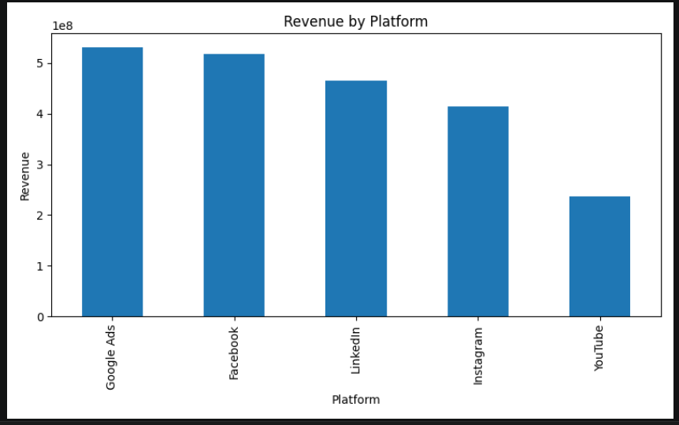
```


---

### Business Interpretation

This visualization compares the total revenue generated across all marketing platforms.

Rather than evaluating campaign volume alone, it highlights each platform's contribution to overall business revenue.

By examining revenue distribution, stakeholders can identify which channels are driving the greatest financial impact and prioritize future investment accordingly.

---

### Business Insight

The analysis indicates that revenue generation is not evenly distributed across platforms.

Certain platforms consistently outperform others, demonstrating stronger customer acquisition efficiency and higher monetization potential.

These differences suggest that marketing performance depends not only on campaign spend but also on audience quality, platform intent, and campaign execution.

---

### Key Takeaway

Revenue should be evaluated alongside marketing cost and ROI.

High-revenue platforms deserve additional investigation to determine whether their financial performance is sustainable and profitable.

---

# 2. Cost vs Revenue by Platform

## Business Question

**Does increased marketing spend lead to proportionally higher revenue?**

### Visualization

```markdown
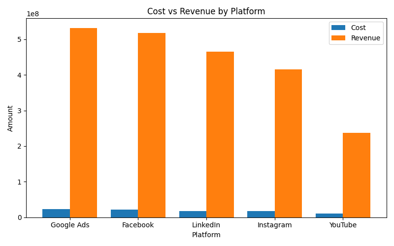
```


---

### Business Interpretation

This comparison evaluates marketing expenditure against the revenue generated by each advertising platform.

By viewing cost and revenue together, decision-makers can quickly identify whether investments are producing meaningful financial returns.

Platforms exhibiting high costs with comparatively lower revenue may require optimization, while platforms generating significantly greater revenue than their associated costs indicate efficient capital allocation.

---

### Business Insight

The visualization demonstrates that spending alone does not determine campaign success.

Some platforms convert marketing investment into revenue far more efficiently than others, emphasizing the importance of evaluating profitability rather than budget size alone.

---

### Key Takeaway

Marketing budgets should be allocated based on return efficiency instead of total expenditure.

Investing more does not necessarily produce better business outcomes.

---

# 3. Revenue by Region

## Business Question

**Which geographic regions contribute the most revenue?**

### Visualization

```markdown
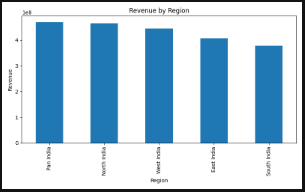
```


---

### Business Interpretation

Regional performance analysis highlights how marketing effectiveness varies across geographic markets.

Understanding regional revenue contribution allows businesses to identify high-performing markets while uncovering regions requiring additional strategic attention.

---

### Business Insight

The analysis reveals noticeable variation in revenue generation across regions.

Higher-performing regions may benefit from increased campaign investment, while lower-performing markets should be investigated to determine whether challenges arise from audience targeting, messaging, budget allocation, or competitive conditions.

---

### Key Takeaway

Geographic segmentation provides valuable guidance for budget planning and localized marketing strategies.

Marketing optimization should consider regional performance rather than applying a uniform investment strategy.

---

# 4. ROI by Platform

## Business Question

**Which marketing platform delivers the highest return on investment?**

### Visualization

```markdown
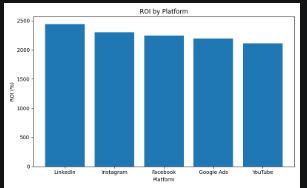
```


---

### Business Interpretation

Revenue alone does not indicate campaign success.

Return on Investment (ROI) measures how effectively each marketing platform converts advertising expenditure into financial returns.

This visualization enables stakeholders to distinguish between platforms that simply generate revenue and those that generate revenue efficiently.

---

### Business Insight

ROI varies substantially across platforms, demonstrating that some advertising channels provide significantly greater financial value for every unit of marketing spend.

Platforms with consistently higher ROI represent strong candidates for future budget expansion.

Lower-performing platforms may require campaign optimization, audience refinement, or revised bidding strategies.

---

### Key Takeaway

ROI should be considered the primary metric when evaluating platform performance, as it reflects both revenue generation and cost efficiency.

---

# 5. Top Campaigns by Revenue

## Business Question

**Which individual marketing campaigns contribute the highest revenue?**

### Visualization

```markdown
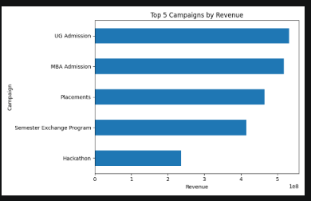
```


---

### Business Interpretation

While platform-level analysis provides a broad overview, campaign-level analysis identifies the specific initiatives driving business success.

This visualization highlights the highest-revenue campaigns, enabling marketing teams to study successful campaign characteristics and replicate winning strategies.

---

### Business Insight

Top-performing campaigns demonstrate that exceptional results are often driven by a small subset of highly effective marketing initiatives.

Analyzing these campaigns can reveal valuable insights into audience targeting, creative design, messaging, campaign objectives, and budget allocation.

---

### Key Takeaway

Successful campaigns should serve as internal benchmarks for future marketing initiatives.

Rather than distributing budgets evenly across campaigns, organizations should prioritize strategies that have already demonstrated measurable business success.

---

# Overall EDA Findings

The exploratory analysis uncovered several important trends that guided the subsequent SQL analysis and Power BI dashboard design.

| Observation                                                                | Business Implication                                                               |
| -------------------------------------------------------------------------- | ---------------------------------------------------------------------------------- |
| Revenue varies significantly across platforms                              | Marketing investment should prioritize higher-performing channels                  |
| Higher expenditure does not always generate higher revenue                 | Budget allocation should focus on efficiency rather than spend volume              |
| Geographic markets contribute differently to overall revenue               | Regional strategies should be customized rather than standardized                  |
| ROI differs substantially across advertising platforms                     | Platform evaluation should emphasize profitability instead of revenue alone        |
| A small number of campaigns contribute a disproportionate share of revenue | Successful campaign characteristics should be replicated across future initiatives |

---

## EDA Business Conclusion

The exploratory analysis confirms that effective marketing performance management requires more than tracking impressions and clicks.

True business value emerges by understanding how marketing investment translates into customer acquisition, revenue generation, and profitability.

These findings established the analytical foundation for the SQL business analyses presented in the following section, where campaign performance is examined using advanced business metrics such as ROI, Funnel Leakage, Cost per Enrollment, Regional Rankings, and Platform Performance Summaries.
---

# SQL Business Analysis

Once the data had been cleaned and loaded into the SQLite database, SQL became the primary tool for transforming transactional marketing data into actionable business intelligence.

Instead of using SQL solely for data retrieval, the queries were designed to answer real-world business questions faced by marketing managers, campaign analysts, and executive stakeholders.

The analysis covers multiple dimensions of marketing performance, including profitability, customer acquisition efficiency, funnel performance, regional effectiveness, and campaign ranking.

Each SQL query demonstrates analytical thinking by combining aggregation, conditional logic, joins, common table expressions (CTEs), and window functions to derive meaningful insights.

---

# SQL Analytics Overview

| Analysis                     | Primary KPI         | Business Focus            |
| ---------------------------- | ------------------- | ------------------------- |
| ROI by Platform              | ROI (%)             | Platform profitability    |
| Cost per Enrollment          | CPE                 | Customer acquisition cost |
| Enrollment Yield Ratio       | Yield Ratio         | Conversion efficiency     |
| Funnel Leakage Analysis      | Leakage Rate        | Funnel optimization       |
| Campaign Ranking             | Revenue Rank        | Campaign performance      |
| Regional Performance         | Revenue & ROI       | Geographic analysis       |
| CPC Benchmark Comparison     | CPC Variance        | Cost optimization         |
| Platform Performance Summary | Multi-KPI Scorecard | Executive reporting       |

---

# 1. ROI by Platform

## Business Question

**Which marketing platform delivers the highest Return on Investment?**

---

## Business Purpose

Revenue alone cannot determine campaign success.

A platform generating high revenue may also require significantly higher advertising spend, reducing its overall profitability.

ROI provides a standardized financial metric that measures how efficiently marketing investment translates into business returns.

This analysis enables stakeholders to compare advertising platforms objectively, regardless of campaign size or budget.

---

## SQL Concepts Used

* Aggregate Functions
* GROUP BY
* SUM()
* Mathematical Expressions
* Calculated Metrics
* ORDER BY

---

## Business Insight

The SQL analysis compares the total revenue generated by each platform against its corresponding marketing expenditure.

Platforms with higher ROI demonstrate stronger financial efficiency by producing greater returns for every unit of advertising spend.

Conversely, platforms with lower ROI may indicate inefficient budget allocation, higher acquisition costs, or campaigns that require optimization.

---

## Business Recommendation

* Increase investment in consistently high-ROI platforms.
* Reevaluate campaigns with persistently low ROI.
* Optimize bidding strategies before increasing advertising budgets.
* Track ROI alongside revenue rather than relying solely on sales volume.

---

# 2. Cost per Enrollment (CPE)

## Business Question

**How much does it cost to acquire one enrolled customer on each marketing platform?**

---

## Business Purpose

Customer acquisition cost is one of the most important metrics in marketing analytics.

Even campaigns generating strong revenue can become financially unsustainable if acquisition costs continue to rise.

Cost per Enrollment provides a clear measure of acquisition efficiency and supports long-term budget planning.

---

## SQL Concepts Used

* SUM()
* Aggregation
* GROUP BY
* Calculated Columns
* NULL Handling

---

## Business Insight

This analysis measures the average marketing expenditure required to produce a single enrollment.

Lower CPE values indicate more efficient customer acquisition, while higher values may suggest ineffective targeting, excessive advertising costs, or poor funnel performance.

---

## Business Recommendation

* Allocate additional budget toward platforms with consistently lower CPE.
* Investigate campaigns with unusually high acquisition costs.
* Improve audience segmentation to reduce customer acquisition expenses.
* Monitor acquisition cost trends over time.

---

# 3. Enrollment Yield Ratio

## Business Question

**How effectively do applications convert into successful enrollments?**

---

## Business Purpose

Generating applications represents only an intermediate stage within the customer acquisition funnel.

The final business objective is enrollment.

The Enrollment Yield Ratio evaluates the effectiveness of converting interested prospects into confirmed customers.

---

## SQL Concepts Used

* Aggregation
* Percentage Calculations
* GROUP BY
* CASE Expressions
* Numeric Formatting

---

## Business Insight

Platforms exhibiting higher enrollment yield demonstrate stronger conversion effectiveness.

Lower-performing platforms may indicate issues related to lead quality, campaign messaging, sales follow-up, or customer experience during later stages of the funnel.

---

## Business Recommendation

* Study high-performing conversion channels to identify successful practices.
* Improve lead nurturing strategies for platforms with lower conversion efficiency.
* Review customer onboarding processes to minimize application abandonment.

---

# 4. Funnel Leakage Analysis

## Business Question

**Where do potential customers leave the marketing funnel?**

---

## Business Purpose

Marketing success depends on guiding customers through multiple conversion stages:

Impressions → Clicks → Leads → Applications → Enrollments

Small conversion losses at each stage accumulate into significant business impact.

Funnel Leakage Analysis identifies where these losses occur, enabling targeted optimization efforts.

---

## SQL Concepts Used

* Common Table Expressions (CTEs)
* Aggregate Functions
* Percentage Calculations
* Multi-step Calculations
* Derived Metrics

---

## Business Insight

Rather than evaluating only final enrollments, this analysis measures conversion performance between every funnel stage.

High leakage at specific stages may indicate:

* Weak advertisement messaging
* Poor landing page experience
* Low-quality lead generation
* Complex application processes
* Inefficient follow-up activities

---

## Business Recommendation

* Prioritize optimization at stages with the highest customer drop-off.
* Simplify application processes.
* Improve landing page design.
* Strengthen lead nurturing campaigns.
* Continuously monitor funnel performance after implementing improvements.

---

# 5. Campaign Ranking

## Business Question

**Which marketing campaigns generate the strongest business performance?**

---

## Business Purpose

Marketing budgets are often distributed across numerous campaigns.

Campaign Ranking identifies top-performing initiatives, enabling organizations to understand which campaigns deserve additional investment and which require strategic review.

---

## SQL Concepts Used

* Window Functions
* RANK()
* ORDER BY
* Aggregate Functions
* GROUP BY

---

## Business Insight

Ranking campaigns by revenue highlights the initiatives producing the greatest business value.

High-performing campaigns can serve as internal benchmarks, while lower-ranked campaigns provide opportunities for optimization or budget reallocation.

---

## Business Recommendation

* Replicate strategies used by top-ranked campaigns.
* Increase investment in consistently successful campaigns.
* Pause or redesign underperforming campaigns.
* Perform deeper analysis on campaign objectives and creative effectiveness.

---

# 6. Regional Performance Analysis

## Business Question

**Which geographic regions contribute most to marketing success?**

---

## Business Purpose

Customer behavior frequently varies across geographic markets.

Regional analysis enables organizations to understand where marketing investments generate the greatest business returns and where regional optimization may be required.

---

## SQL Concepts Used

* GROUP BY
* SUM()
* AVG()
* Ranking
* ORDER BY

---

## Business Insight

The analysis compares regional revenue generation, marketing expenditure, and conversion performance.

High-performing regions may indicate stronger market demand, while lower-performing regions could reflect audience mismatch, competitive pressure, or insufficient campaign localization.

---

## Business Recommendation

* Expand successful campaigns within high-performing regions.
* Investigate weaker markets before increasing advertising spend.
* Customize messaging according to regional customer preferences.
* Optimize budget allocation geographically.

---

# 7. CPC Benchmark Comparison

## Business Question

**How do campaign costs compare with industry benchmark CPC values?**

---

## Business Purpose

Evaluating campaign performance without considering industry benchmarks can lead to misleading conclusions.

Comparing actual campaign costs against benchmark CPC values provides context for assessing advertising efficiency.

---

## SQL Concepts Used

* JOIN Operations
* Aggregate Functions
* Calculated Metrics
* Comparative Analysis

---

## Business Insight

Campaigns operating below benchmark CPC values demonstrate efficient cost management.

Campaigns significantly exceeding industry benchmarks may indicate poor bidding strategies, intense competition, or ineffective audience targeting.

---

## Business Recommendation

* Maintain campaigns consistently performing below benchmark CPC.
* Review keyword strategies for expensive campaigns.
* Refine audience targeting to improve advertising efficiency.
* Continuously compare operational costs against market standards.

---

# 8. Platform Performance Summary

## Business Question

**How does each platform perform across multiple business metrics simultaneously?**

---

## Business Purpose

Individual KPIs often provide only a partial view of marketing performance.

Executives require consolidated reporting that combines revenue, cost, ROI, enrollment efficiency, and customer acquisition into a single performance summary.

---

## SQL Concepts Used

* Multiple Aggregate Functions
* GROUP BY
* Calculated Metrics
* CASE Statements
* Business KPI Aggregation

---

## Business Insight

The platform performance summary serves as an executive scorecard, enabling side-by-side comparison of all marketing channels.

Rather than evaluating a single KPI, stakeholders can assess overall platform performance using a balanced combination of financial and operational indicators.

---

## Business Recommendation

* Use multiple KPIs when evaluating platform performance.
* Avoid investment decisions based on a single metric.
* Balance revenue growth with acquisition efficiency and profitability.
* Review performance periodically to support continuous optimization.

---

# SQL Techniques Demonstrated

The SQL analysis incorporates a range of analytical concepts commonly used in professional business intelligence and data analytics roles.

| SQL Feature                     | Application in Project            |
| ------------------------------- | --------------------------------- |
| SELECT                          | Data retrieval                    |
| WHERE                           | Record filtering                  |
| GROUP BY                        | Platform and regional aggregation |
| ORDER BY                        | Performance ranking               |
| SUM()                           | Revenue and cost calculations     |
| AVG()                           | Average performance metrics       |
| COUNT()                         | Campaign volume analysis          |
| CASE WHEN                       | Conditional business logic        |
| Common Table Expressions (CTEs) | Funnel calculations               |
| Window Functions                | Campaign ranking                  |
| RANK()                          | Revenue-based ranking             |
| Mathematical Expressions        | ROI, CPE, Yield Ratio             |
| JOIN                            | Benchmark CPC comparison          |
| Derived Columns                 | Business KPI generation           |

---

# Business Value of SQL Analysis

The SQL layer transforms raw marketing records into structured business intelligence that supports strategic decision-making.

Rather than manually calculating marketing KPIs, SQL automates performance measurement across multiple dimensions, ensuring consistency, scalability, and reproducibility.

The resulting analyses provide answers to critical business questions, including:

* Which platforms maximize profitability?
* Which campaigns deserve additional investment?
* Where do customers abandon the marketing funnel?
* Which regions generate the strongest financial returns?
* How efficient are customer acquisition efforts?
* Are advertising costs aligned with industry benchmarks?

These insights form the analytical backbone of the Power BI dashboard, where the SQL-derived metrics are presented through interactive visualizations for executive stakeholders.

---

# Transition to Power BI Dashboard

While SQL provides detailed analytical outputs, business leaders often require interactive and visually intuitive reporting.

To bridge the gap between technical analysis and executive decision-making, the SQL results were integrated into a multi-page Power BI dashboard.

The dashboard enables stakeholders to:

* Monitor marketing performance in real time
* Explore campaign results interactively
* Compare advertising platforms
* Identify funnel bottlenecks
* Evaluate regional performance
* Optimize future marketing investment using data-driven insights

The following section documents each dashboard page, its objectives, key performance indicators, visual components, and the strategic business decisions it supports.

---

# Power BI Dashboard

The final phase of this project transforms SQL outputs and exploratory insights into an interactive executive dashboard built using **Microsoft Power BI**.

The dashboard is designed for marketing managers, business analysts, and executive stakeholders who require fast, data-driven insights without writing SQL queries.

Rather than presenting isolated charts, the dashboard tells a complete business story—from high-level performance monitoring to detailed platform analysis and optimization opportunities.

---

# Dashboard Design Philosophy

The dashboard follows a progressive analytical approach:

```text
Executive Overview
        │
        ▼
Marketing Funnel Analysis
        │
        ▼
Platform Performance Analysis
        │
        ▼
Marketing Optimization
```

Each page answers a different business question while allowing users to drill deeper into campaign performance.

---

# Dashboard Features

* Executive KPI Cards
* Interactive Filters
* Cross-Visual Filtering
* Dynamic Slicers
* Drill-down Analysis
* Funnel Visualization
* Geographic Analysis
* Platform Comparison
* Performance Ranking
* Marketing Optimization Insights

---

# Dashboard Navigation

| Page   | Focus Area                    |
| ------ | ----------------------------- |
| Page 1 | Executive Overview            |
| Page 2 | Funnel Performance Analysis   |
| Page 3 | Platform Performance Analysis |
| Page 4 | Marketing Optimization        |

---

# Page 1 — Executive Overview

```markdown

```


---

## Purpose

The Executive Overview serves as the primary dashboard for monitoring overall marketing performance.

It provides decision-makers with an immediate understanding of campaign effectiveness through key business metrics and high-level visualizations.

Rather than examining individual campaigns, this page focuses on organization-wide marketing performance.

---

## Key Performance Indicators

* Total Revenue
* Total Marketing Cost
* ROI (%)
* Applications
* Enrollments
* Cost per Enrollment

These KPIs provide an executive summary of marketing efficiency and financial performance.

---

## Visual Components

| Visual                        | Purpose                      |
| ----------------------------- | ---------------------------- |
| KPI Cards                     | Overall business performance |
| Revenue Trend                 | Revenue growth monitoring    |
| Platform Revenue Comparison   | Channel contribution         |
| Regional Revenue Distribution | Geographic performance       |
| ROI Visualization             | Financial efficiency         |
| Interactive Slicers           | Dynamic filtering            |

---

## Business Insights

The Executive Overview enables stakeholders to quickly determine:

* Overall campaign profitability
* Marketing return on investment
* Customer acquisition performance
* Geographic contribution to revenue
* Platform-level business contribution

The dashboard reduces the need for manual reporting by consolidating multiple performance metrics into a single executive view.

---

## Business Recommendations

* Monitor KPI trends regularly to detect performance changes.
* Use ROI rather than revenue alone when allocating future budgets.
* Increase investment in consistently profitable marketing channels.
* Track cost efficiency alongside campaign growth.

---

# Page 2 — Marketing Funnel Analysis

```markdown
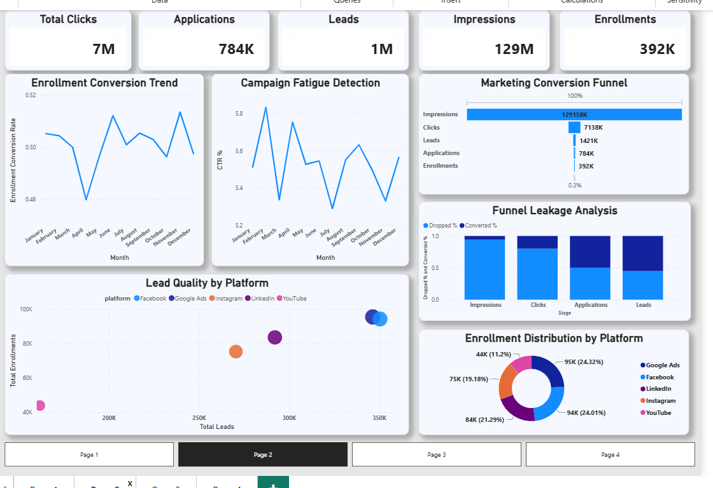
```


---

## Purpose

Marketing performance depends on successfully guiding customers through multiple stages of the acquisition funnel.

This dashboard identifies where potential customers leave the conversion process, enabling focused optimization efforts.

---

## Funnel Stages

```text
Impressions
      │
      ▼
Clicks
      │
      ▼
Leads
      │
      ▼
Applications
      │
      ▼
Enrollments
```

---

## KPIs

* Funnel Leakage Rate
* Click-through Performance
* Lead Generation
* Applications
* Enrollments
* Enrollment Yield Ratio

---

## Visual Components

| Visual            | Business Purpose                    |
| ----------------- | ----------------------------------- |
| Funnel Chart      | Stage-by-stage customer progression |
| Conversion KPIs   | Funnel efficiency                   |
| Platform Filter   | Compare funnel performance          |
| Supporting Charts | Stage comparison                    |

---

## Business Insights

The funnel analysis reveals where customer attrition occurs throughout the acquisition journey.

Rather than focusing exclusively on final enrollments, this page highlights intermediate conversion losses that significantly influence campaign performance.

Marketing teams can identify whether optimization efforts should focus on advertisement engagement, lead generation, application completion, or enrollment conversion.

---

## Business Recommendations

* Improve stages exhibiting the highest customer drop-off.
* Optimize landing pages to increase click-to-lead conversion.
* Simplify application processes.
* Strengthen follow-up strategies for qualified leads.
* Continuously monitor funnel leakage after implementing improvements.

---

# Page 3 — Platform Performance Analysis

```markdown
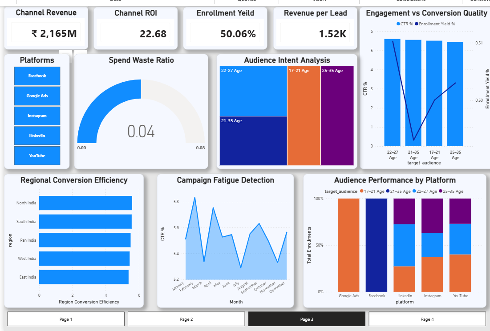
```


---

## Purpose

Different advertising platforms serve different audiences and campaign objectives.

This dashboard enables stakeholders to compare platform performance across multiple business metrics and then examine each platform individually.

The page supports both strategic budget allocation and tactical campaign optimization.

---

## KPIs

* Revenue
* ROI
* Enrollment Yield Ratio
* Revenue per Lead
* Cost per Enrollment
* Applications
* Enrollments

---

## Dashboard Capabilities

* Overall comparison across all platforms
* Platform-specific drill-down
* Dynamic slicers
* Revenue comparison
* ROI comparison
* Audience analysis
* Conversion efficiency

---

# Overall Platform Analysis

## Business Objective

Provide a consolidated view of all marketing platforms before performing detailed platform-specific analysis.

---

## Business Insights

Comparing platforms side-by-side allows stakeholders to distinguish between:

* Revenue leaders
* ROI leaders
* Efficient customer acquisition channels
* High-performing audiences
* Cost-intensive campaigns

This holistic comparison prevents decisions based solely on a single KPI.

---

## Recommendation

Future marketing budgets should balance:

* Revenue generation
* Cost efficiency
* Customer acquisition
* Conversion quality
* Long-term profitability

---

# Google Ads Dashboard

```markdown
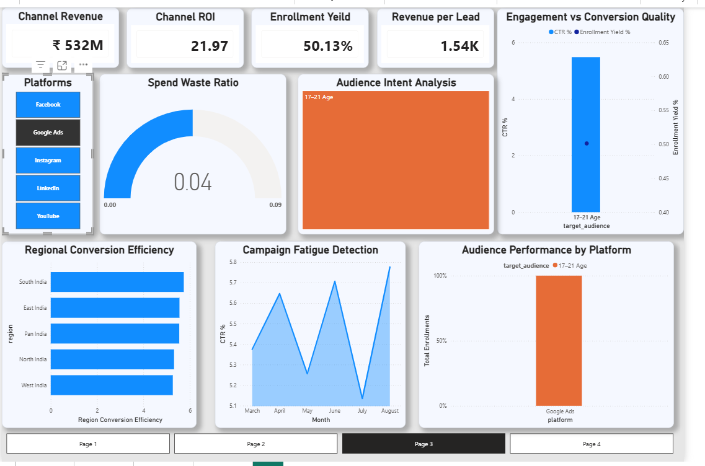
```


---

## Revenue

The dashboard highlights Google's contribution to overall business revenue and allows users to evaluate campaign profitability within this channel.

---

## ROI

ROI visualizations help determine whether Google advertising expenditure produces satisfactory financial returns.

---

## Enrollment Yield

Measures how effectively Google-generated applications convert into enrollments.

---

## Revenue per Lead

Evaluates the financial value generated by each lead acquired through Google Ads.

---

## Audience

Interactive filtering allows users to analyze audience performance across different customer segments.

---

## Strengths

* Strong search intent
* High purchase readiness
* Reliable lead generation
* Consistent conversion potential

---

## Weaknesses

* Potentially higher advertising costs
* Competitive keyword bidding
* ROI sensitivity to campaign optimization

---

## Business Recommendation

Continue investing in high-performing search campaigns while optimizing keyword selection and bidding strategies to maintain profitability.

---

# Facebook Dashboard

```markdown
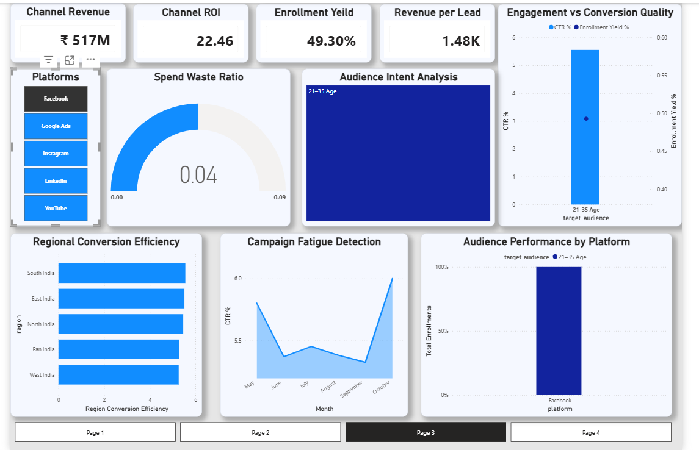
```


---

## Revenue

Evaluates Facebook's contribution to total marketing revenue.

---

## ROI

Measures the financial efficiency of Facebook advertising campaigns.

---

## Enrollment Yield

Assesses conversion effectiveness from applications to enrollments.

---

## Revenue per Lead

Analyzes the monetary value generated by each Facebook lead.

---

## Audience

Supports audience segmentation analysis through interactive filtering.

---

## Strengths

* Broad audience reach
* Effective demographic targeting
* High campaign scalability

---

## Weaknesses

* Lower purchase intent for some audiences
* Creative fatigue
* Increased competition

---

## Business Recommendation

Refresh advertising creatives regularly and improve audience segmentation to maximize campaign efficiency.

---

# Instagram Dashboard

```markdown
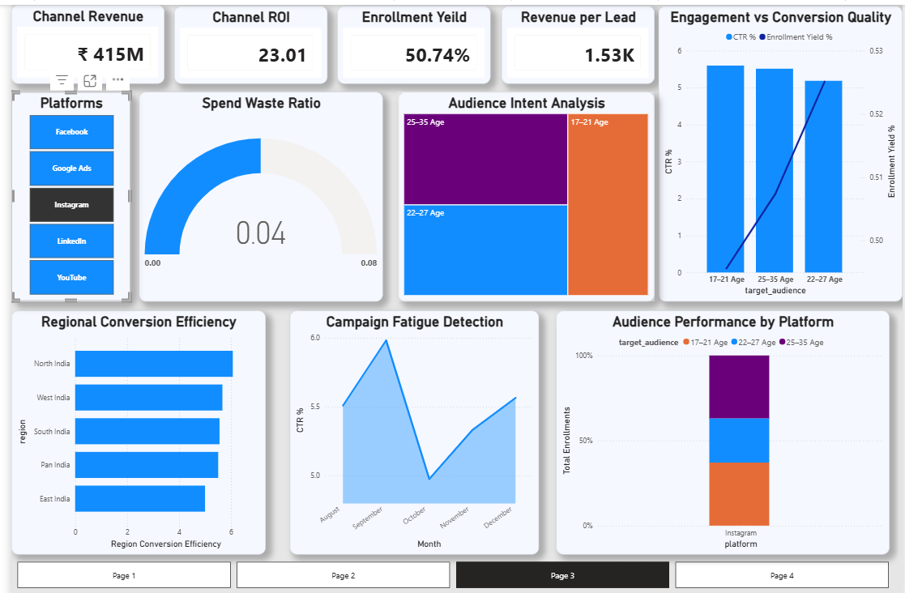
```


---

## Revenue

Tracks Instagram's revenue contribution across campaigns.

---

## ROI

Measures profitability relative to advertising expenditure.

---

## Enrollment Yield

Evaluates conversion effectiveness after application submission.

---

## Revenue per Lead

Measures lead monetization efficiency.

---

## Audience

Supports analysis of engagement among visually oriented audience segments.

---

## Strengths

* High engagement
* Strong visual marketing capabilities
* Brand awareness potential

---

## Weaknesses

* Conversion may vary by campaign objective
* Performance depends heavily on creative quality

---

## Business Recommendation

Invest in high-quality visual content while continuously testing creatives to improve engagement and conversion.

---

# LinkedIn Dashboard

```markdown
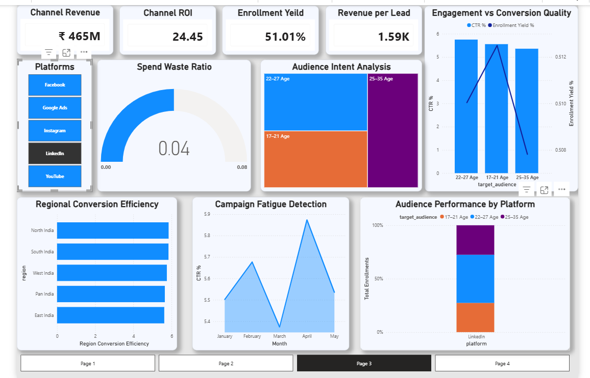
```


---

## Revenue

Measures LinkedIn's contribution to campaign revenue.

---

## ROI

Evaluates profitability for professional audience targeting.

---

## Enrollment Yield

Tracks conversion quality throughout the enrollment process.

---

## Revenue per Lead

Determines the value generated by each professional lead.

---

## Audience

Focuses on professional and business-oriented customer segments.

---

## Strengths

* High-quality professional audience
* Strong lead quality
* Business-focused targeting

---

## Weaknesses

* Higher acquisition costs
* Smaller audience size
* Premium advertising pricing

---

## Business Recommendation

Prioritize campaigns targeting high-value customers where lead quality outweighs advertising cost.

---

# YouTube Dashboard

```markdown
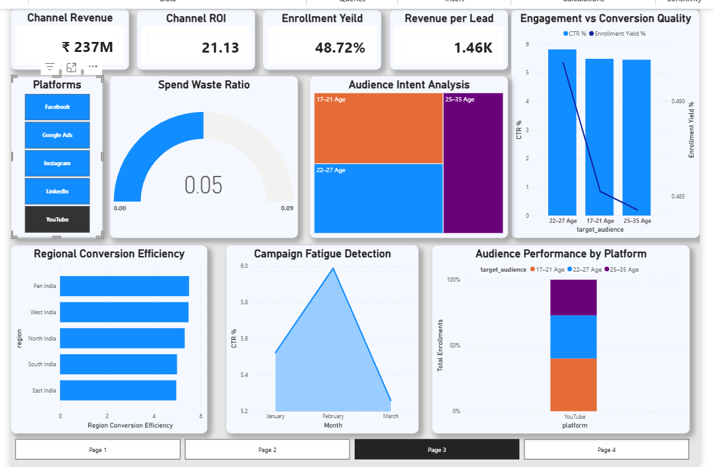
```


---

## Revenue

Measures YouTube campaign revenue contribution.

---

## ROI

Analyzes profitability generated through video advertising.

---

## Enrollment Yield

Evaluates customer conversion following video engagement.

---

## Revenue per Lead

Measures financial return generated from YouTube-acquired leads.

---

## Audience

Examines audience engagement across video marketing campaigns.

---

## Strengths

* Strong brand awareness
* High audience reach
* Excellent storytelling capabilities
* Long-form customer engagement

---

## Weaknesses

* Longer customer decision journey
* Higher creative production effort
* Revenue realization may take longer

---

## Business Recommendation

Use YouTube to strengthen top-of-funnel awareness while integrating remarketing strategies to improve downstream conversions.

---

# Page 4 — Marketing Optimization Dashboard

```markdown
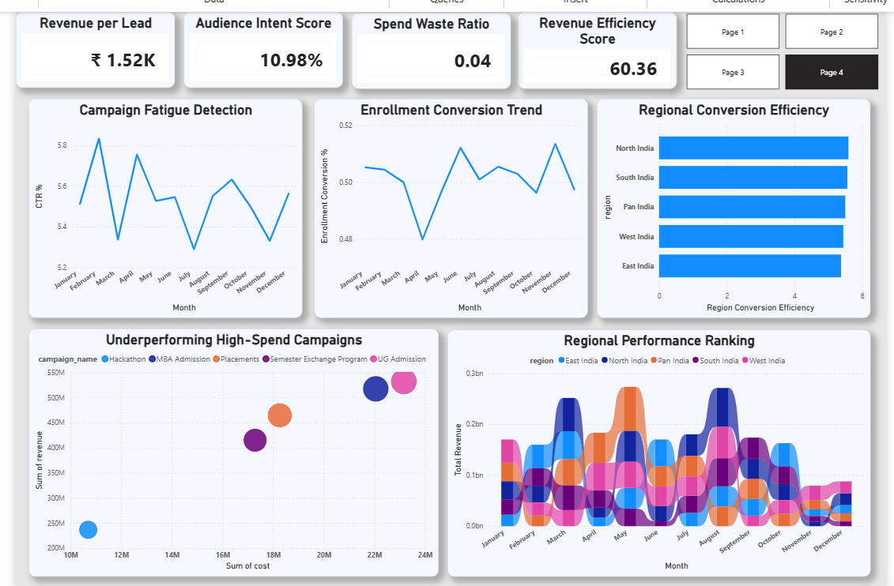
```


---

## Purpose

The final dashboard page focuses on translating analytical findings into actionable business decisions.

Rather than presenting descriptive metrics alone, this page highlights optimization opportunities that can improve marketing performance and maximize return on investment.

---

## KPIs

* ROI
* Cost per Enrollment
* Revenue per Lead
* Funnel Leakage
* Platform Ranking
* Regional Performance

---

## Visual Components

| Visual               | Business Value            |
| -------------------- | ------------------------- |
| KPI Cards            | Performance summary       |
| Comparative Charts   | Platform benchmarking     |
| Optimization Metrics | Improvement opportunities |
| Interactive Filters  | Dynamic decision support  |

---

## Business Insights

This dashboard consolidates the analytical findings from previous pages into a decision-support interface.

Stakeholders can quickly identify:

* High-performing platforms
* Underperforming campaigns
* Cost optimization opportunities
* Funnel improvement priorities
* Geographic expansion opportunities

---

## Business Recommendations

* Redirect budget toward high-ROI platforms.
* Reduce investment in persistently underperforming campaigns.
* Improve conversion stages with significant leakage.
* Continuously benchmark acquisition costs against industry standards.
* Use dashboard insights as part of recurring marketing performance reviews.

---

---

# Executive Insights

The analysis demonstrates that effective marketing performance cannot be measured using a single metric. A campaign generating high revenue may not necessarily be the most profitable, just as a campaign with low acquisition costs may not generate sufficient business value.

By combining Python-based preprocessing, SQL business analysis, exploratory visualization, and interactive Power BI reporting, the project provides a holistic view of marketing performance across multiple dimensions.

## Key Executive Findings

| Area                      | Insight                                                                          | Business Impact                                                                                               |
| ------------------------- | -------------------------------------------------------------------------------- | ------------------------------------------------------------------------------------------------------------- |
| Platform Performance      | Marketing platforms exhibit significant variation in revenue generation and ROI. | Budget allocation should prioritize financially efficient platforms rather than those with the highest spend. |
| Funnel Efficiency         | Customer drop-off occurs across multiple stages of the acquisition funnel.       | Optimizing bottlenecks can increase enrollments without increasing advertising spend.                         |
| Customer Acquisition Cost | Cost per Enrollment differs considerably between platforms.                      | Acquisition efficiency should guide investment decisions.                                                     |
| Geographic Performance    | Regional markets contribute differently to overall business revenue.             | Localized campaign strategies can improve marketing effectiveness.                                            |
| Campaign Performance      | A subset of campaigns generates a disproportionate share of revenue.             | Successful campaign characteristics should be replicated across future initiatives.                           |
| Cost Efficiency           | Higher advertising spend does not consistently translate into higher revenue.    | Marketing investments should emphasize ROI over expenditure.                                                  |

---

# Strategic Recommendations

Based on the analytical findings, the following recommendations can improve marketing performance and maximize business value.

## 1. Prioritize ROI-Driven Budget Allocation

Instead of increasing budgets uniformly across all channels, prioritize investment in platforms that consistently deliver strong ROI and sustainable profitability.

**Expected Outcome**

* Improved return on advertising spend
* Higher marketing efficiency
* Better financial performance

---

## 2. Reduce Funnel Leakage

Analyze the stages with the highest customer drop-off and implement targeted improvements.

Potential initiatives include:

* Simplifying application forms
* Improving landing page experience
* Enhancing call-to-action messaging
* Strengthening lead follow-up

**Expected Outcome**

* Increased conversion rates
* Higher enrollment volume
* Lower acquisition cost

---

## 3. Optimize Customer Acquisition Cost

Monitor Cost per Enrollment alongside revenue to ensure marketing growth remains financially sustainable.

Potential actions include:

* Refining audience targeting
* Improving bidding strategies
* Eliminating low-performing advertisements

**Expected Outcome**

* Lower customer acquisition costs
* Improved campaign efficiency
* Higher marketing profitability

---

## 4. Expand Successful Campaign Strategies

Study the characteristics of high-performing campaigns and apply successful practices across future marketing initiatives.

Potential focus areas:

* Creative design
* Audience segmentation
* Campaign objectives
* Messaging strategy
* Budget allocation

**Expected Outcome**

* Greater campaign consistency
* Higher average campaign performance
* Faster optimization cycles

---

## 5. Implement Continuous Performance Monitoring

Marketing performance changes over time due to competition, customer behavior, and seasonal trends.

Organizations should continuously monitor:

* ROI
* Revenue
* Cost per Enrollment
* Funnel Leakage
* Regional Performance
* Campaign Rankings

Using interactive dashboards enables proactive decision-making rather than reactive reporting.

---

# Business Impact

This project demonstrates how an end-to-end analytics workflow can transform raw operational data into meaningful business intelligence.

The solution enables organizations to:

* Monitor marketing performance from a centralized dashboard.
* Evaluate campaign profitability using financial KPIs.
* Detect inefficiencies within the customer acquisition funnel.
* Compare marketing platforms using standardized performance metrics.
* Support data-driven budget allocation and strategic planning.

By integrating multiple stages of the analytics lifecycle, the project showcases how technical analysis can directly influence business decision-making.

---


# Installation

## Clone the Repository

```bash
git clone https://github.com/your-username/marketing-performance-intelligence.git
```

---

## Navigate to the Project Directory

```bash
cd marketing-performance-intelligence
```

---

## Install Dependencies

```bash
pip install -r requirements.txt
```

---

## Run the Data Cleaning Script

```bash
python scripts/data_cleaning.py
```

---

## Load the SQLite Database

```bash
python scripts/load_data.py
```

---

## Run the Exploratory Data Analysis

```bash
python scripts/eda.py
```

---

## Open the Power BI Dashboard

Navigate to:

```text
powerbi/
└── Marketing Performance Intelligence Dashboard.pbix
```

Open the `.pbix` file using **Microsoft Power BI Desktop**.

---

# Future Enhancements

The current project provides a complete end-to-end analytics workflow. Future iterations could extend its capabilities through advanced analytics and automation.

## Planned Improvements

* Predictive modeling for campaign revenue forecasting.
* Time-series analysis of campaign performance trends.
* Customer segmentation using clustering techniques.
* Interactive web deployment using Streamlit.
* Automated ETL pipelines for scheduled data refresh.
* Integration with cloud-based databases such as PostgreSQL or Azure SQL.
* Real-time dashboard connectivity using live data sources.
* Advanced DAX measures for enhanced executive reporting.
* Natural Language Query (Q&A) functionality in Power BI.
* Machine learning models for campaign success prediction.

These enhancements would transition the project from descriptive analytics toward predictive and prescriptive decision support.

---

# Repository Highlights

## End-to-End Analytics Pipeline

✔ Data Cleaning using Python

✔ Structured SQLite Database

✔ Business SQL Analysis

✔ Exploratory Data Analysis

✔ Interactive Power BI Dashboard

✔ Executive Business Insights

✔ Strategic Recommendations

---


### Connect


* **GitHub:** https://github.com/arshyanawas
* **LinkedIn:** https://linkedin.com/in/arshyanawas
* **Email:** arshyanawas.ai@gmail.com


